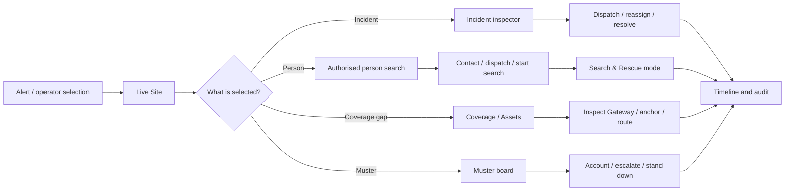

# Loc8 Command - Application Map and Build Contract

**Status:** Active implementation contract  
**Updated:** 2026-07-23  
**Source of truth:** [`COMMAND-FEATURE-MANIFEST.md`](COMMAND-FEATURE-MANIFEST.md)

This document turns the no-drop feature inventory into the actual Command
application structure. A mode is the operator's current mission context. A
workspace is the tool they open while carrying out that mission. The spatial
view, inspector, activity timeline and command dock remain shared surfaces.

## 1. Product structure

```mermaid
flowchart TB
  C[Loc8 Command]

  C --> M[Persistent operating modes]
  M --> M1[Live Site]
  M --> M2[Investigation]
  M --> M3[Person Search]
  M --> M4[Search & Rescue]

  C --> W[Operational workspaces]
  W --> W1[Live Site]
  W --> W2[Incidents]
  W --> W3[Team & Shift]
  W --> W4[Coverage]
  W --> W5[Muster]
  W --> W6[Assets]
  W --> W7[Assisted Search & Audit]
  W --> W8[Commissioning]

  C --> S[Shared operating surfaces]
  S --> S1[2D / 3D site canvas]
  S --> S2[Context inspector]
  S --> S3[Activity timeline]
  S --> S4[Command dock]
  S --> S5[Alerts, health and clock]

  C --> P[Delivery surfaces]
  P --> P1[Command Web]
  P --> P2[Command Desktop]
  P --> P3[Command Field tablet]
  P --> P4[Guard handoff]
  P --> P5[Vision handoff]
```

## 2. What changes and what stays put

| Operator action | Changes | Stays put |
|---|---|---|
| Change mode | spatial emphasis, inspector priority, timeline lanes, recommended actions | selected site, live connection, workspace, authorised layers |
| Change workspace | primary tools and records | selected mode, site, time context, selected operational object where possible |
| Select map object | inspector, map focus, related timeline events | mode and workspace |
| Move timeline cursor | visible historical state and event detail | site model and operator permissions |
| Toggle 2D/3D | rendering and camera | identities, selections, layers, incidents and history |

## 3. Feature-to-surface matrix

| Surface | Primary job | Existing capability retained | Digital-twin addition |
|---|---|---|---|
| Live Site | understand the venue now | summary, live feed, roster, coverage, incident drill-down, call muster | whole-site 2D/3D picture and multi-lane timeline |
| Incidents | own and resolve events | queue, acknowledge, escalate, dispatch, reassign, messages, resolve, audit | spatial focus, routes, responder movement and historical playback |
| Team & Shift | coordinate people | roster, role, state, zone, welfare, communications | freshness, live trail, assignment and floor context |
| Coverage | find communications/positioning weakness | density, gaps, privacy, mesh state | Gateway/anchor layers, blind spots and coverage-aware routes |
| Muster | account for everyone | call, check in, outstanding, assembly, stand down | floor-aware exit routes and 2D/3D assembly context |
| Assets | operate infrastructure | Gateway and venue-package state | anchors, cameras, doors, health, freshness and inspection |
| Assisted Search & Audit | authorised person lookup | consent basis, operator reason, last position, contact, dispatch, audit/export | trail, sectors, nearest teams and related timeline |
| Commissioning | create trusted site data | Map Builder, registration, package simulation, sensor replay | production scene contract feeding both 2D and 3D |

## 4. Mode composition

### Live Site

- Default whole-site view.
- Incidents, teams, crowd density, coverage and infrastructure health are
  visible at operational priority.
- Inspector defaults to the highest-priority active event.
- Timeline shows important events across incidents, people and infrastructure.

### Investigation

- Focuses one incident, person, team, asset or place without losing the site.
- Inspector expands evidence, communications, actions and audit context.
- Timeline isolates the selected object's event history.
- 2D/3D focus follows the same stable object identity.

### Person Search

- Requires an authorised subject, operator identity and reason.
- Shows last known position, source, confidence, age and contact attempts.
- Adds nearby authorised responders, recommended routes and bounded search area.
- Every reveal and action is logged.

### Search & Rescue

- Coordinates search sectors, teams, K9 units and medical standby.
- Shows searched/unsearched areas, sector progress and team routes.
- Timeline carries person, team, sector, radio and system lanes.
- Supports reassignment, mark-area-clear and command handoff.

## 5. Screen paths

## 6. Build sequence

**Integrated web status (2026-07-23):** slices 1-5 are present in the unified
Command runtime. The digital-twin scene, existing operational workflows and
Commissioning tools now share one frame and store; the previous legacy overlay
is no longer used. Slice 6 remains a packaging/delivery track after the web
application is proven.

### Slice 1 - unified frame

- Persistent mode bar.
- Complete workspace rail.
- Existing production-oriented dashboards retained behind the new frame.
- Site, health, incident count and operator state always visible.
- Solid-black material foundation.

### Slice 2 - Live Site spatial canvas

- Replace the current simple tactical map with the scene adapter.
- Bind 2D first, then add 3D as a second renderer over the same scene data.
- Add object selection, floor scope, layers and context inspector.

### Slice 3 - shared timeline and inspector

- Move incident history into reusable event lanes.
- Connect object selection, current-time cursor and audit context.
- Preserve all existing incident actions.

### Slice 4 - search and rescue

- Person search trail and contact history.
- Search sectors, progress and team assignment.
- Live radio/command feed and operational actions.

### Slice 5 - coverage, assets and muster

- Coverage/mesh/Gateway/anchor layers.
- Asset inspection and degraded-state workflows.
- Floor-aware muster and evacuation context.

### Slice 6 - desktop and tablet

- Package the proven web product in a Tauri desktop proof.
- Build the touch-first Command Field shell from the same contracts using the
  exact Expo SDK 57 documentation.

## 7. Definition of done for every slice

- No capability in the feature manifest is silently removed.
- Every operational mutation is permission-checked and auditable.
- Confidence, source, freshness and degraded state remain visible.
- Keyboard operation and accessible names work.
- Scripted data cannot be mistaken for live data.
- 2D and 3D show the same selected objects and state.
- Tests and the Command production build pass.
