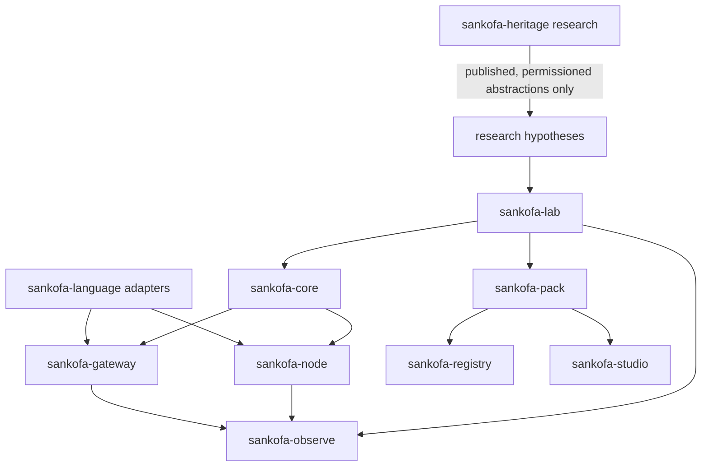
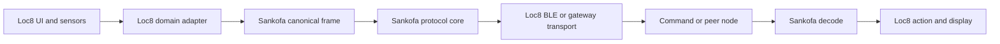

# Software Map

## 1. Programme software, not one application

Sankofa should be built as a family of bounded systems. Putting protocol, model, historical archive, mobile UI and research dashboard into one codebase would make evidence, security and product decisions impossible to separate.

The names below are working module names rather than final brands.

## 2. Software portfolio

| System | Purpose | Initial technology | Phase |
|---|---|---|---|
| `sankofa-lab` | Reproducible benchmark laboratory | Python | Phase 0 |
| `sankofa-core` | Production protocol types, encoding and validation | Rust | After Phase 0 |
| `sankofa-pack` | Pack compiler, validator and conformance tools | Python first, Rust later | Phase 0 to 1 |
| `sankofa-registry` | Signed pack catalogue and revocation metadata | Local files first, service later | Phase 1 |
| `sankofa-node` | Mobile/edge client runtime | Kotlin and Swift, core via Rust bindings | Phase 2 |
| `sankofa-gateway` | Local model, pack cache and store-and-forward node | Rust service with pluggable inference | Phase 2 |
| `sankofa-studio` | Ontology, domain pack and translation authoring | TypeScript/React | Phase 1 to 2 |
| `sankofa-observe` | Research and operational metrics dashboard | TypeScript plus analysis service | Phase 1 |
| `sankofa-language` | Model adapters, evaluation and language resources | Python plus runtime-specific adapters | Research track |
| `sankofa-heritage` | Governed research corpus and formalisation tools | Separate access-controlled repositories | Research track |

The historical corpus must not be bundled automatically into the open protocol repository.

## 3. Dependency direction



Rules:

- `sankofa-core` must not depend on a language model.
- model adapters depend on the canonical semantic interface, not the reverse.
- transport adapters depend on opaque packet bytes.
- pack authoring tools do not receive authority to publish without governance and signing.
- historical source data moves into engineering only through a documented, permissioned abstraction.

## 4. Phase 0 repository blueprint

```text
sankofa/
├── README.md
├── AGENTS.md
├── pyproject.toml
├── Makefile
├── src/
│   └── sankofa_lab/
│       ├── canonical/
│       │   ├── models.py
│       │   ├── types.py
│       │   └── validation.py
│       ├── packs/
│       │   ├── loader.py
│       │   ├── manifest.py
│       │   ├── compatibility.py
│       │   └── compiler.py
│       ├── encoders/
│       │   ├── utf8_text.py
│       │   ├── json_encoder.py
│       │   ├── cbor_encoder.py
│       │   ├── protobuf_encoder.py
│       │   └── sankofa_v0.py
│       ├── safety/
│       │   ├── invariants.py
│       │   ├── syndrome.py
│       │   ├── risk_graph.py
│       │   └── id_assignment.py
│       ├── channel/
│       │   ├── faults.py
│       │   ├── fragmentation.py
│       │   └── profiles.py
│       ├── render/
│       │   ├── templates.py
│       │   └── locales.py
│       ├── benchmark/
│       │   ├── runner.py
│       │   ├── metrics.py
│       │   ├── break_even.py
│       │   └── reports.py
│       └── cli.py
├── schemas/
├── packs/
├── datasets/
├── experiments/
├── tests/
│   ├── unit/
│   ├── property/
│   ├── conformance/
│   └── integration/
├── reports/
└── docs/
```

Codex should create this implementation repository from the packet only after producing its readiness report.

## 5. Phase 0 technology choices

### Python 3.12+

Use for fast research iteration, optimisation experiments and reproducible analysis.

Suggested packages:

- Pydantic for typed canonical frames;
- Typer for CLI;
- pytest for tests;
- Hypothesis for property-based tests;
- cbor2 for CBOR baseline;
- official Protobuf tooling for a schema-driven baseline;
- pandas or Polars for result analysis where justified;
- NetworkX or a custom graph representation for early risk-code experiments;
- OR-Tools for small optimisation formulations if needed.

Dependencies must be pinned and licences recorded.

### Why not build Rust first

The protocol is still a hypothesis. Early work will change schemas, metrics and experiments repeatedly. Python lowers research friction.

### Why Rust later

A production core benefits from:

- deterministic memory-safe implementation;
- compact native libraries;
- Android, iOS, desktop and embedded reuse;
- WebAssembly compilation;
- strong serialisation ecosystem;
- property and fuzz testing;
- bindings through UniFFI or equivalent.

The Rust port begins only after the logical model and conformance vectors stabilise.

## 6. Core interfaces

### `SemanticInterpreter`

```text
interpret(input, domain_pack, locale_context) -> CandidateFrame
render(validated_frame, locale_context) -> RenderedMeaning
```

The interface returns confidences and alternatives. It never emits trusted packet bytes directly.

### `FrameValidator`

```text
validate(candidate_frame, domain_pack, policy) -> ValidationResult
```

### `PacketCodec`

```text
encode(validated_frame, context, profile) -> bytes
decode(bytes, context) -> DecodedFrame
```

### `ContextResolver`

```text
resolve(packet_context_ref, installed_packs) -> CompatibilityResult
```

### `SafetyChecker`

```text
check(frame, safety_envelope, policy) -> SemanticSyndrome
```

### `TransportAdapter`

```text
send(bytes, destination, delivery_policy)
receive() -> TransportEnvelope
```

### `PackStore`

```text
install(signed_pack)
resolve(pack_ref)
verify(pack_ref)
revoke(pack_ref)
```

## 7. Data stores

### Phase 0

Use files under version control:

- JSON Schema;
- YAML or JSON packs;
- CSV benchmark messages;
- JSON experiment manifests;
- CSV and JSON results.

### Edge node

Likely local SQLite plus content-addressed pack files.

Stores:

- installed manifests;
- message queue;
- bounded conversation state;
- local overlay;
- keys through platform secure storage;
- user-approved language preferences;
- revocation state.

### Gateway

Likely SQLite or an embedded transactional store plus content-addressed blobs. A public cloud database is not a requirement.

## 8. Mobile node map

### Shared functions

- pack manager;
- canonical frame and policy engine;
- packet codec through shared core;
- message queue;
- transport adapters;
- confirmation UI;
- template renderer;
- model-adapter interface;
- secure key storage;
- local diagnostics.

### Android

Potential stack:

- Kotlin;
- Jetpack Compose;
- BLE and Wi-Fi Direct APIs;
- LiteRT-LM or another evaluated local runtime;
- Rust core through JNI or UniFFI.

### Apple platforms

Potential stack:

- Swift;
- SwiftUI;
- CoreBluetooth and local networking;
- Apple Foundation Models where device support and language quality are adequate;
- alternative local model runtime where policy permits;
- Rust core through UniFFI or C ABI.

No mobile model is selected permanently at architecture level.

## 9. Gateway map

The gateway is a local service, not necessarily a cloud service.

Components:

- local API for weak clients;
- signed pack mirror;
- local model host;
- translation and rendering service;
- store-and-forward queue;
- transport bridge;
- time and context service;
- revocation distributor;
- encrypted operational log according to policy;
- optional dashboard.

Possible hardware:

- existing laptop;
- small x86 mini-PC;
- ARM single-board computer;
- rugged field computer;
- advanced phone acting temporarily as gateway.

## 10. Authoring studio

`sankofa-studio` should allow governed contributors to:

- define concepts and relations;
- create intent schemas;
- classify field criticality;
- create risk confusion pairs;
- write deterministic templates;
- add language mappings;
- declare non-equivalence or restricted meaning;
- run conformance examples;
- inspect encoded size;
- preview meaning cards;
- submit a pack for review and signing.

The studio is not an unrestricted ontology generator. Publication requires role-based review.

## 11. Research dashboard

The dashboard should compare:

- bytes by encoder and profile;
- context break-even curves;
- task accuracy;
- slot accuracy;
- catastrophic undetected errors;
- false rejection;
- performance by language;
- performance by device tier;
- pack mismatch failures;
- energy and latency estimates;
- risk-weighted code assignment versus baselines.

Every chart must link back to an experiment manifest and machine-readable results.

## 12. Loc8 integration map

Loc8 can be a first proving ground without making Sankofa dependent on Loc8.

Potential semantic domains:

- crew member separated;
- assistance requested;
- medical incident;
- hazard reported;
- rendezvous changed;
- battery critical;
- last-known location;
- route blocked;
- all-clear;
- cancellation and acknowledgement.

Integration boundary:



Loc8 remains a product application. Sankofa remains a reusable meaning layer.

## 13. Build order

1. `sankofa-lab` reference benchmark.
2. domain-pack compiler and conformance tooling.
3. freeze logical v0 test vectors.
4. production `sankofa-core` in Rust.
5. desktop/gateway integration.
6. deterministic Tier 0 mobile client.
7. local model adapters.
8. real transport experiments.
9. authoring studio and governed registry.
10. broader product integrations.

Starting with a polished AI mobile app would hide the research question and create avoidable technical debt.
